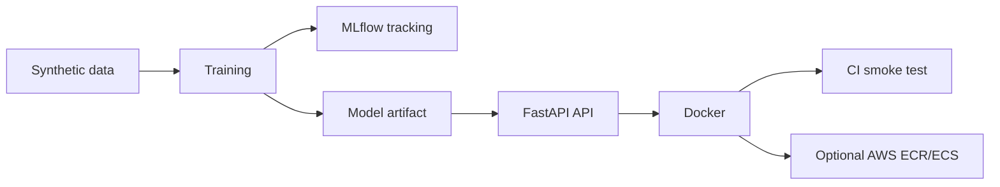

# Pharma MLOps Clinical Risk Demo

This repository demonstrates a production-grade MLOps pattern for a pharma-style clinical risk scoring use case. It focuses on reproducibility, model serving, CI/CD, Docker, Terraform, observability, and secure cloud deployment practices.

The demo is educational and engineering-focused. It is not a medical device, diagnostic tool, or clinical recommendation system. It uses synthetic data only.

## Business Context

Clinical trial operations need reproducible, auditable, and cost-aware ML systems. This project shows how a simple risk model can be trained, packaged, served, tested, and optionally deployed with AWS infrastructure as code.

## Architecture



## Quickstart

```bash
python -m venv .venv
source .venv/bin/activate
pip install -r requirements.txt
python training/data_generator.py
python training/train.py
uvicorn app.main:app --reload --host 0.0.0.0 --port 8000
```

In another terminal:

```bash
bash scripts/smoke_test.sh
```

## Train Model

```bash
python training/data_generator.py
python training/train.py
```

Training writes `artifacts/model.pkl`, `artifacts/model_metadata.json`, and local MLflow runs under `mlruns/`.

## Run API Locally

```bash
uvicorn app.main:app --reload --host 0.0.0.0 --port 8000
```

Endpoints:

- `GET /health`
- `GET /metadata`
- `GET /metrics`
- `POST /predict`

## Example Prediction

```bash
bash scripts/predict_example.sh
```

## Test

```bash
pytest -q
ruff check .
```

## Docker

```bash
docker build -t pharma-mlops-clinical-risk-api:local .
docker run --rm -p 8000:8000 pharma-mlops-clinical-risk-api:local
bash scripts/smoke_test.sh
```

## CI/CD

GitHub Actions runs linting, unit tests, a training smoke test, Docker build, and a container smoke test. It does not deploy to AWS and does not require AWS credentials.

## Optional AWS Deployment

Terraform lives in `infra/terraform` and targets `us-east-1` by default.

```bash
cd infra/terraform
terraform init
terraform fmt
terraform validate
terraform plan
terraform apply
terraform destroy
```

`ecs_desired_count` defaults to `0` for cost control. Increase it to `1` only when you intentionally want to run the API.

## Security

- No credentials belong in this repo.
- Use `.env.example` for documented configuration.
- Do not commit `.env`, AWS keys, tokens, private keys, real patient data, or PHI.
- Terraform uses S3 public access blocks, encryption, scoped IAM roles, and short log retention.

## Cost Control

The local demo is free. Optional AWS resources can create cost, especially ALB, ECS Fargate, CloudWatch, S3, and ECR. Destroy resources after demos:

```bash
cd infra/terraform
terraform destroy
```

## Repository Structure

```text
app/                 FastAPI service
training/            Synthetic data, training, evaluation, registry helpers
tests/               API, feature, and training smoke tests
scripts/             Local run, prediction, Docker, and smoke helpers
infra/terraform/     Optional AWS infrastructure
docs/                Architecture, lifecycle, security, cost, pharma, pitch, model card
```

## Interview Pitch

The goal of this demo is not only to train a model, but to show how I would operationalize ML in a regulated enterprise environment. It includes training, model versioning, serving, testing, deployment automation, infrastructure as code, observability, and security controls.

## Roadmap

See `docs/roadmap.md`.
