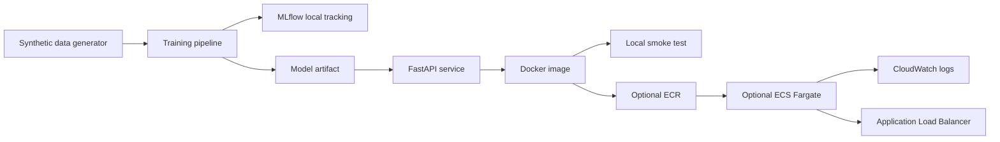

# Architecture

This demo is local-first and cloud-optional. The local path proves reproducible training, model artifact creation, API serving, tests, Docker packaging, and smoke testing without AWS credentials.

The AWS path is intentionally optional. Terraform defines S3, ECR, IAM, CloudWatch, ECS Fargate, security groups, and an ALB. `ecs_desired_count` defaults to `0` to avoid running compute by accident.
